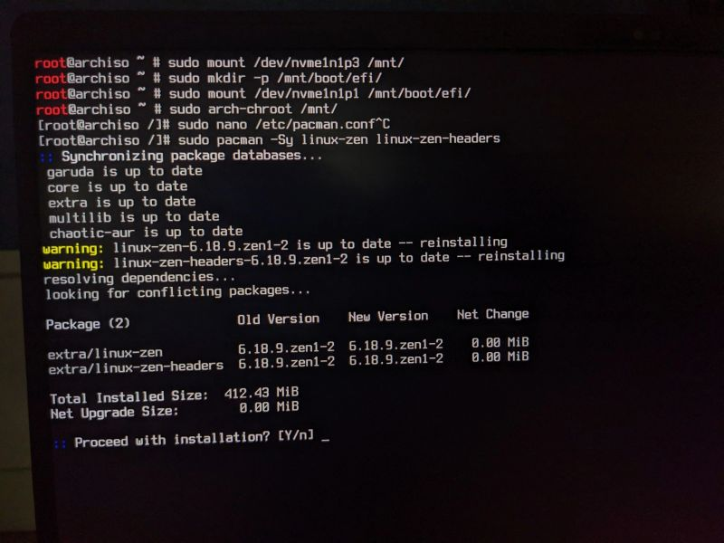
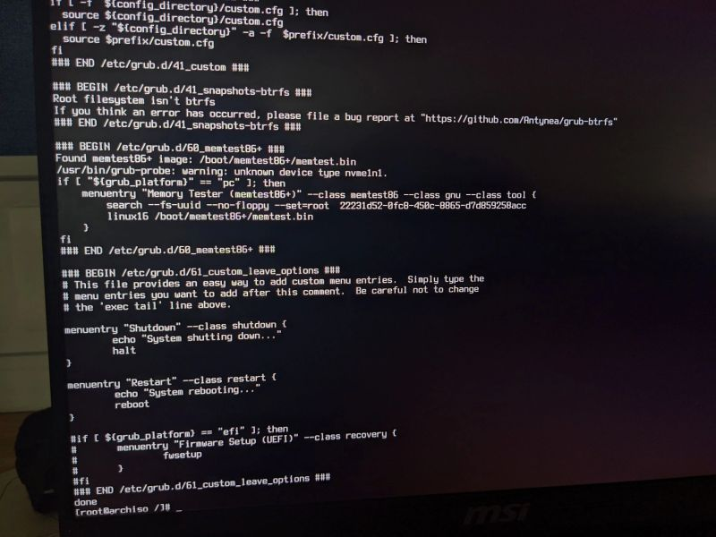
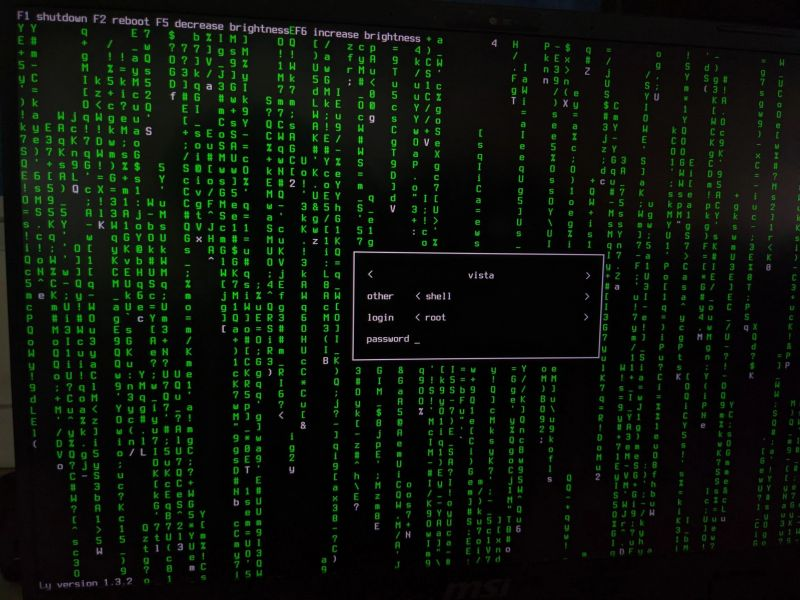

## Part of: DevOps-Lab → Linux Internals

# Arch Linux Manual Installation Guide: Part 2 (Chroot Environment)

_This guide covers the final steps of manually installing and setting up Arch Linux after partitioning and mounting._

---

## **1. Basic System Configuration**

Before diving into kernels or fancy setups, ensure your system has the essentials.

### **① Essential Setup Commands**

To avoid silent failures or future headaches:

```bash
# Generate locale (critical for proper system behavior)
localectl set-locale LANG=en_US.UTF-8

# Set hostname (replace 'myarchbox' with your desired name)
echo "myarchbox" > /etc/hostname

# Configure /etc/hosts (add your hostname and IP)
echo "127.0.1.1 myarchbox" >> /etc/hosts

# Set root password
passwd
```

> **⚠️ Warning:**
>
> - Skipping locale generation may cause silent misconfigurations.
> - Forgetting the root password will lock you out of sudo privileges.

---

## **2. Kernel Installation**

Arch Linux offers multiple kernels for different use cases:

### **Available Kernels**

| Kernel Name      | Description                                                                       |
| ---------------- | --------------------------------------------------------------------------------- |
| `linux`          | Standard vanilla kernel (default choice).                                         |
| `linux-lts`      | Long-term support, fewer updates but more stable.                                 |
| `linux-zen`      | Optimized for low latency and performance/stability balance (**My favorite!**).   |
| `linux-hardened` | Security-focused with strict hardening features.                                  |
| `linux-cachyos`  | Gaming-optimized scheduler tweaks (less stable, popular among Windows switchers). |



### **Why Multiple Kernels?**

- Linux is modular.
- Performance tuning is a culture.
- Benchmarking boot times or gaming performance.

### **Installation Commands**

```bash
# Install kernel packages
pacman -S linux linux-firmware intel-ucode amd-ucode  # Replace with your CPU type

# Select kernel at boot (edit `/boot/grub/grub.cfg` or use `systemctl isolate`)
```

---

## **3. Basic Utilities**

Essential tools for a functional system:

```bash
# Install core utilities
pacman -S vim sudo networkmanager

# Enable networking (critical before reboot!)
systemctl enable NetworkManager
```

> **⚠️ Warning:**
> A system without internet after installation is a great way to test your patience!

---

## **4. Bootloader Configuration**

Choose your bootloader:

| Bootloader     | Description                              |
| -------------- | ---------------------------------------- |
| `GRUB`         | Universal and reliable (default choice). |
| `systemd-boot` | Minimal and clean (no GRUB overhead).    |
| `rEFInd`       | Most refined, supports UEFI/Legacy BIOS. |

### **Installation Example (GRUB)**

````bash
# Install GRUB
pacman -S grub

# Configure GRUB in chroot
grub-install /dev/sdX  # Replace with your disk (e.g., /dev/nvme0n1)
grub-mkconfig -o /boot/grub/grub.cfg

## 

## **5. User Creation (The Humbling Step)**

Creating a user is critical for sudo privileges.

### **Commands**

```bash
# Create and set up the user
useradd -m -G wheel -s /bin/bash myuser
passwd myuser

# Edit sudo rules (replace `EDITOR` with your preferred editor)
EDITOR=vim visudo
````

> **⚠️ Warning:**
> Forgetting to add `myuser` to the `wheel` group will lock you out of `sudo`.

---

## **6. Login Manager (GUI Options)**

After first boot, decide how fancy you want your login screen:

| Display Manager | Description                                                                     |
| --------------- | ------------------------------------------------------------------------------- |
| `GDM`           | Heavy but integrated with GNOME.                                                |
| `SDDM`          | Modern and themeable (popular in `r/unixporn`).                                 |
| `LightDM`       | Lightweight and flexible.                                                       |
| **`Ly`**        | **TUI-based**, minimal CPU/memory usage, ASCII art aesthetic! ✨ _(My choice!)_ |

### **Installation Example (`Ly`)**

```bash
pacman -S ly
systemctl enable --now ly
```

## 

## **7. Hashtags & Tags**

#ArchLinux | #DevOps | #LinuxKernel | #SysAdmin | #CLI | #HomeLabs | #DIY | #TechSkills | #SRE

See also:

- boot-chain-internals.md
- arch-install.md
