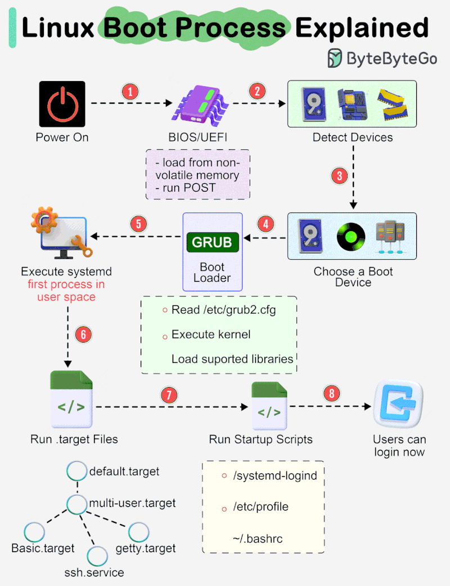
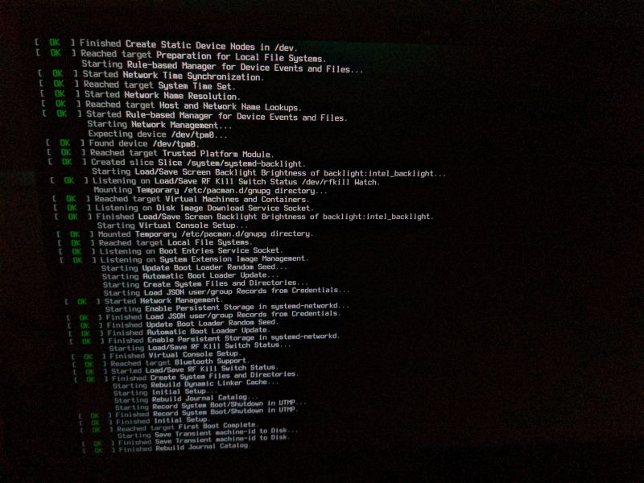
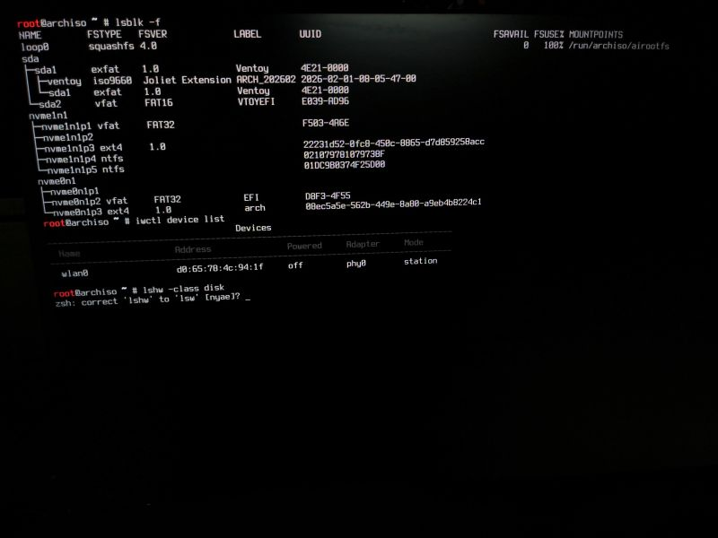

Here’s your previous part reformatted into a detailed GitHub README with technical depth, diagrams (conceptual), and structured sections:

---


# Arch Linux Manual Installation Guide: Part 1 – Boot Process & Initial Setup

*Exploring the inner workings of Linux from boot to user space.*

---

## **Introduction**
(〜￣△￣)〜 Instead of documenting every step publicly, I’ve spent months diving deep into Linux internals—boot configuration, system initialization, and low-level hardware interactions.

Most users install an OS and stop at "it boots." But what *actually* happens between pressing the power button and reaching the login prompt? This guide breaks down the hidden complexity beneath modern systems.

---

## **The Boot Process: A Deep Dive**
### **1. Power On → UEFI → Kernel Entry**
Linux booting follows a layered architecture:

```
Power Button Pressed
 ↓
**UEFI** (Unified Extensible Firmware Interface)
 ↓
Bootloader (GRUB/systemd-boot/rEFInd)
 ↓
Kernel (linux-image)
 ↓
initramfs (Temporary root filesystem)
 ↓
systemd (PID 1) / init (Alternative: `init` in minimal setups)
 ↓
User Space
```
 
#### **Key Components Explained**
| Stage          | Role                                                                                     |
|----------------|-----------------------------------------------------------------------------------------|
| **UEFI**       | Firmware layer that replaces BIOS; handles bootloader selection from EFI System Partition (ESP). |
| **Bootloader** | Loads the kernel into memory. Options: `GRUB` (universal), `systemd-boot` (minimal), or `rEFInd` (UEFI/Legacy support). |
| **Kernel**     | Core OS logic; initializes hardware, mounts root filesystem via `initramfs`.             |
| **initramfs**  | Temporary root filesystem containing drivers for critical hardware (e.g., SATA, USB).      |
| **systemd/init** | Process manager (PID 1); starts services and transitions to user space.                |

> **Technical Note:**
> - UEFI uses a **FAT32/FAT16 EFI System Partition (ESP)** for bootloader storage.
> - The kernel’s `init` function (in `init.c`) triggers the transition from `initramfs` to the real root filesystem.

---

### **2. Boot Process Visualization**


*UEFI → Bootloader → Kernel → initramfs → systemd → User Space*
  
#### **Why This Matters**
- Understanding these layers reveals how Linux handles hardware abstraction, security (e.g., UEFI Secure Boot), and modularity.
- Modern systems hide complexity; breaking it down exposes the "magic" behind seamless operation.

---

## **Mounting the Root Filesystem**
Once the kernel loads `initramfs`, it mounts the real root partition:

```bash
# Example: Mounting /dev/sdX1 (replace with your actual partition)
mount /dev/sdX1 /mnt  # Temporary mount point for chroot
```

#### **Key Considerations**
- **Filesystem Type:** Common types include `ext4`, `btrfs`, or `xfs`; choose based on performance needs.
- **Chroot Environment:** After mounting, you enter a restricted environment where `/dev`, `/proc`, and `/sys` are symlinked to the host system:
  ```bash
  chroot /mnt /bin/bash
  ```
 
  
- **Alternative: `systemd-boot`**
  If using `systemd-boot`, the kernel directly mounts root without `initramfs` (simpler but less flexible).

---

## **Alternatives to systemd**
While `systemd` dominates modern Linux, other init systems exist:

| Init System | Philosophy                          | Use Case                                  |
|-------------|-------------------------------------|-------------------------------------------|
| **`init`**  | Minimalist, Unix tradition          | Lightweight setups (e.g., embedded systems). |
| **`runit`** | Process-oriented, modular           | Highly customizable (used in Alpine Linux). |

> **Fun Fact:**
> MacOS is also based on Unix, which inspired Linus Torvalds to create Linux from scratch in C. Both systems share core traits like:
> - Kernel-space user space separation.
> - Process management via `fork()`/`exec()`.
> - Filesystem hierarchies (e.g., `/dev`, `/proc`).

---
---
### **Hashtags & Tags**
#LinuxKernel #SysAdmin #BootProcess #UEFI #initramfs #SystemDesign #CLI #DevOps #ArchLinux #UnixPhilosophy #HardwareAbstraction

---
**Final Thought:**
Linux booting is a symphony of layers—each component plays its part to deliver a seamless experience. Dive deeper, and you’ll uncover why it’s both powerful and fascinating!


