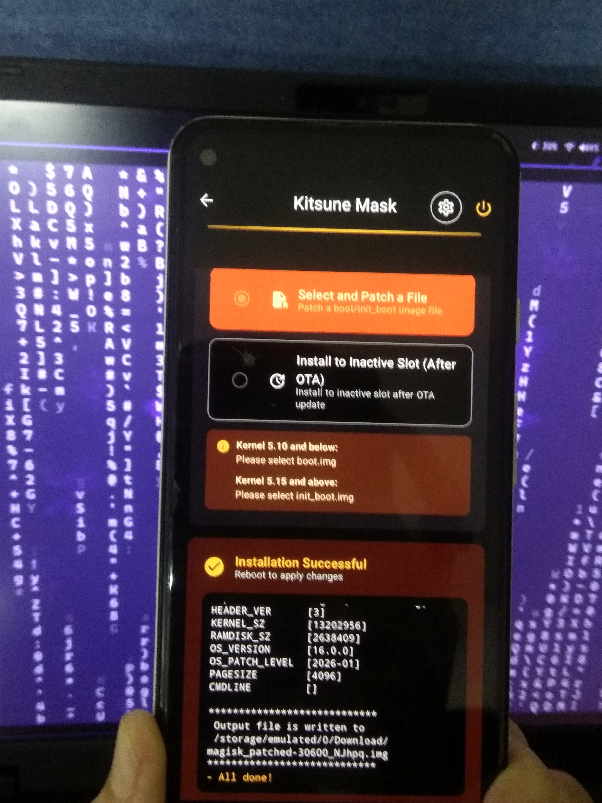
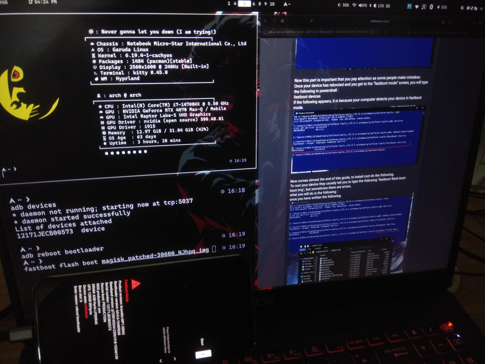
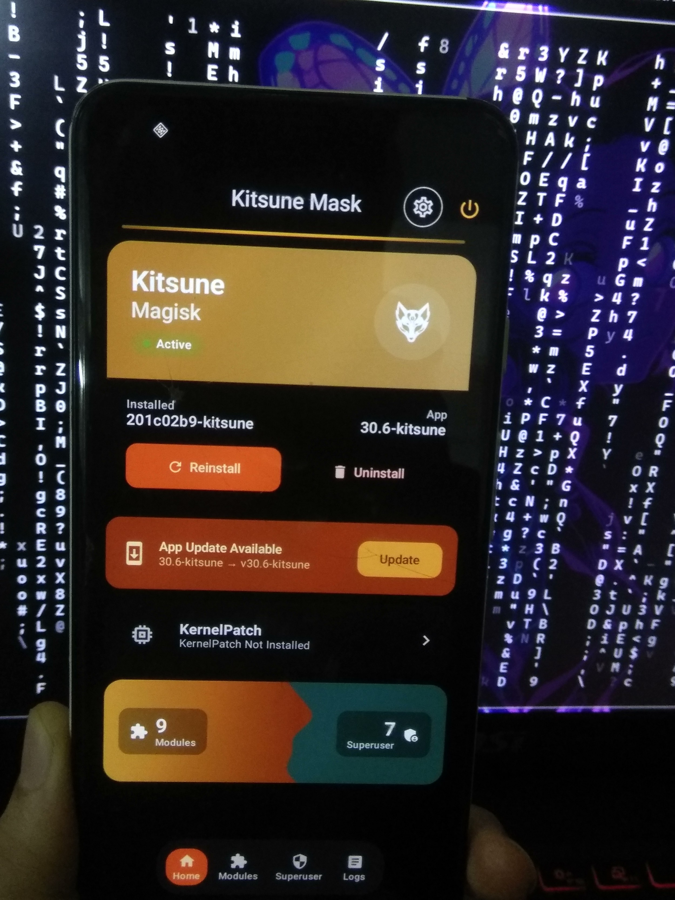

# Running Linux Without a Second Computer – Part 3: Android Chroot with Magisk

---

## **Introduction**

In previous posts, we built an Arch Linux system from scratch. However, there's a practical challenge when experimenting without a second machine:

> _"Most people assume they need two systems—one to work on and another to safely break."_

Instead of relying on a secondary device, we can leverage Android via **Termux**, which acts as a lightweight Linux environment.

This guide explores **proot** vs. **chroot** for running Linux userspaces in Termux, with a focus on **Magisk** rooting and **kernel-level solutions**.

---

## **Proot vs. Chroot: Key Differences**

| Feature         | Proot                             | Chroot                       |
| --------------- | --------------------------------- | ---------------------------- |
| **Root Access** | No (user-space only)              | Requires root privileges     |
| **Performance** | Slower (syscall interception)     | Near-native speed            |
| **Filesystem**  | Emulated isolation                | Direct kernel manipulation   |
| **Mounts**      | Limited access to `/proc`, `/dev` | Full access with bind mounts |
| **Use Case**    | Quick experiments                 | Native-like environments     |

### **When to Use Each**

- **Proot**: Ideal for quick testing (e.g., package managers, basic tools).
- **Chroot**: Preferred for real-world applications needing full system compatibility.

---

## **What Chroot Actually Does**

The term **"chroot"** means _"change root."_ In Linux, every process sees `/` as its filesystem root. When using `chroot`, a process is launched with a different root directory:

```bash
/data/linux-root/
```

becomes `/` for that process.

### **How It Works**

1. The kernel changes the working directory of a process.
2. All paths relative to `/` are interpreted from the new root.
3. Example:
   ```bash
   chroot /data/linux-root /bin/bash
   ```
   Inside, `/etc`, `/home`, and `/dev` appear as `/etc`, `/home`, and `/dev`—but they’re actually under `/data/linux-root`.

### **Why Bind Mounts Are Critical**

Chroot alone doesn’t automatically include kernel interfaces like:

- `/proc` (process info)
- `/sys` (system attributes)
- `/dev` (device files)

**Solution:** Use `mount --bind` to share these directories:

```bash
mount --bind /proc chroot/proc
mount --bind /sys chroot/sys
mount --bind /dev chroot/dev
```

This makes the chroot behave like a real Linux system.

---

## **Getting Root on Android**

### **1. Magisk: The Modern Root Solution**

Magisk is the most widely used rooting tool for Android, replacing older methods like **Su** (which required modifying `/system`).

#### **Why Magisk?**

√ **Systemless**: Patches the boot image instead of modifying `/system`.
√ **OTA Compatible**: Updates don’t break root.
√ **Modular**: Allows hiding root from certain apps.
√ **Cross-Device Support**: Works on most Android versions.

#### **Magisk vs. KernelSU**

| Feature           | Magisk                    | KernelSU                   |
| ----------------- | ------------------------- | -------------------------- |
| **Root Method**   | Systemless (patches boot) | Kernel-level root          |
| **Compatibility** | Broad support             | Requires compatible kernel |
| **Security**      | Less invasive             | More secure (kernel hooks) |

#### **Magisk Workflow**

1. Install Magisk via [F-Droid](https://f-droid.org/en/packages/com.topjohnwu.magisk/) or APK.

(Or in our case we are using special fork magisk called Kitsume Revived

- better hiding than normal magisk ( has SuList instead of standard denyList )
- Includes KernalPatch for kpatch modules and deeper control( optional)
- has built in bootloop protection module that Auto-disable on bootloop

  )



2. Extract the boot image:
   ```bash
   adb reboot bootloader
   fastboot devices
   fastboot flash boot original_boot.img  # Backup first!
   ```
3. Patch the boot image with Magisk:
   ```bash
   magisk --install-module /path/to/magisk_module.apk
   ```
4. Flash the patched image:
   ```bash
   fastboot flash boot modified_magisk_boot.img
   fastboot reboot
   ```
   


---

### **2. KernelSU: Advanced Root Alternative**

For deeper control, **KernelSU** replaces Magisk by modifying the kernel directly.

#### **Pros of KernelSU**

√ No system partition modifications.
√ More secure (kernel hooks).
√ Better for custom kernels.

#### **Cons**

X Requires a compatible kernel.
X Less user-friendly than Magisk.

#### **Installation Steps**

1. Install [KernelSU](https://github.com/tianmao624/KernelSU) via APK or F-Droid.
2. Flash the required modules:
   ```bash
   fastboot flash kernel kernel.img
   fastboot reboot
   ```
3. Enable KernelSU in **Settings > Security > Root Access**.

---

## **Next Steps: Running a Chroot in Termux**

With Magisk/KernelSU rooting complete, you can now run a real chroot inside Termux:

```bash
# Create a minimal Linux environment
mkdir -p /data/linux-root/{bin,etc,proc,sys,dev}
chmod 755 /data/linux-root/bin

# Copy essential files (simplified example)
cp /usr/lib/systemd/systemd /data/linux-root/bin/
cp /usr/share/man/* /data/linux-root/etc/

# Bind mounts
mount --bind /proc /data/linux-root/proc
mount --bind /sys  /data/linux-root/sys
mount --bind /dev  /data/linux-root/dev

# Run chroot
chroot /data/linux-root /bin/bash
```

---

here is a brief picture of how kitsume looks btw :)


## **Hashtags & Tags**

#AndroidRooting #Magisk #KernelSU #Chroot #Termux #LinuxOnAndroid #SysAdmin #DevOps #CLI #Security #BootloaderModification #SystemlessRoot

---

### **Final Notes**

- Magisk remains the most stable choice for most users.
- KernelSU offers deeper control but requires kernel compatibility.
- Chroot in Termux provides near-native Linux behavior without a second device, proot is still good solution for set of experiemnt for people who don't wanna root
